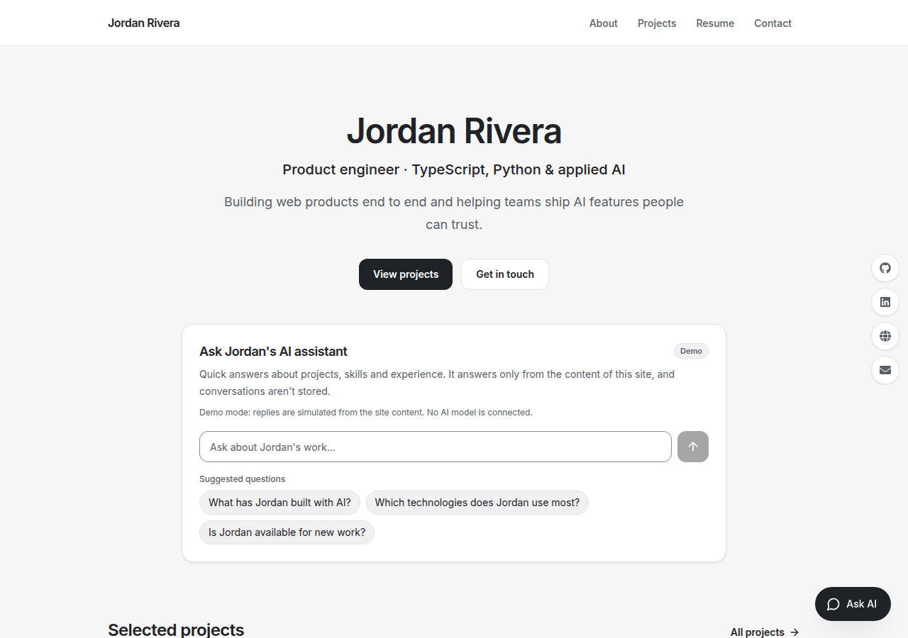
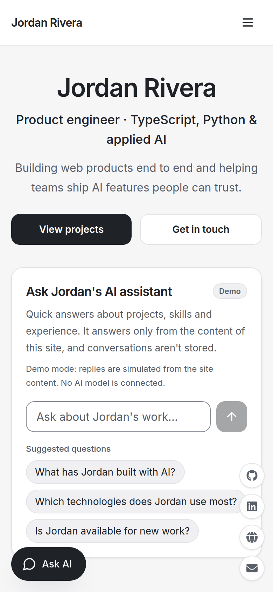
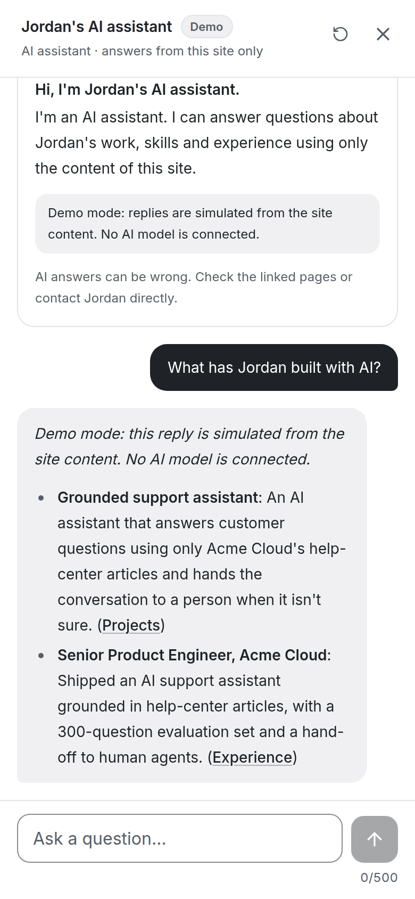

# AI Portfolio Template

A personal portfolio website with an optional AI assistant that answers visitors' questions using only the
content of the site. Built with Next.js, it is configured from one typed content file and works with or
without an AI provider.



<p align="center">
  
  &nbsp;&nbsp;
  
</p>

The screenshots show the bundled example profile, **Jordan Rivera, a fictional person**. The chat screenshot
was taken in demo mode, where replies are simulated from the site content and labeled as such.

**See a customized implementation in production:** [mikin.ai](https://mikin.ai), the author's own portfolio.

## What you get

- **Pages:** Home, About, Projects, Resume and Contact, plus a 404 page. Content, projects and contact details
  are fully usable without the chat.
- **One content file:** your profile lives in `src/content/en/profile.ts`, a typed object checked by
  `pnpm content:check` (and before every build). The pages and the assistant read the same data, so they
  can't drift apart.
- **AI assistant (optional):** a featured card on the home page and a floating "Ask AI" button on every
  page that opens the chat panel. It answers only from your content, says when it doesn't know, never invents
  experience, clients, certifications or availability, and never acts or commits on your behalf.
- **Floating links:** small buttons on the right edge for your social profiles and email (plus "back to
  top"), taken from the same content as the footer.
- **Three chat modes:** `live` (a real model through any OpenAI-compatible API), `demo` (simulated replies,
  clearly labeled, no model and no cost) and `off`. Without an API key the chat is off and the site works
  normally.
- **Abuse and cost guards:** payload and message limits, per-visitor rate limits, per-conversation quotas, an
  estimated token budget, and daily caps per visitor and for the whole site, backed by Upstash Redis or (for
  development) memory. A request that is turned away uses up no quota.
- **Monochrome, accessible design:** light gray background, white surfaces, graphite text; keyboard
  navigation, visible focus, skip link, reduced-motion support; tested from 320 px wide to desktop.
- **SEO basics:** metadata, canonical URLs, Open Graph images generated from your content, JSON-LD, sitemap,
  robots and web manifest. The example profile is marked `noindex`.
- **Ready for more languages:** routes are `/{locale}/…`; English ships by default and adding a language is a
  documented, type-checked step.
- **Optional contact form** through [Resend](https://resend.com), with a honeypot and rate limiting.

## How the assistant works

It is **not RAG and not an agent**:

- Your whole profile (a few thousand tokens) is placed in the model's system prompt on every request,
  wrapped in delimiters and marked as data. There is no vector database, retrieval index or web browsing.
- The "related pages" shown under an answer are keyword matches, not retrieval citations.
- The assistant has no tools and takes no actions. Requests such as "email Jordan for me" or "book a call"
  get a fixed reply that points to the Contact page, without calling the model.
- Conversations are not stored on the server. The browser keeps the transcript and sends recent turns
  with each question; the server validates and trims them.

Security does not rely on the prompt alone: nothing secret is ever in the model's context (your content is
public by design), the model cannot do anything but write text, its output is rendered without HTML, and
links are restricted to your own pages and URLs that appear in your content. A small regex filter rejects
obvious prompt-injection attempts as a first line, not as the main defense.

## Stack

| Layer | Choice |
|---|---|
| Framework | Next.js 16 (App Router, Turbopack), React 19, TypeScript 5 |
| Styling | Tailwind CSS 3 with CSS-variable color tokens; Inter via `next/font` |
| AI | Any OpenAI-compatible Chat Completions API, called with `fetch` (no SDK) |
| Rate limits | Upstash Redis (`@upstash/ratelimit`), or in-memory for development |
| Email | Resend REST API (optional) |
| Analytics | Vercel Web Analytics (optional, off by default) |
| Tests | Vitest (the AI provider is always mocked) |
| Package manager | pnpm 10 |

## Architecture

```
src/
  content/            Your data: profile.ts (typed), messages.json (UI text), chat.json (assistant UI text)
    schema.ts         Content types and the validator used by `pnpm content:check`
  app/
    [locale]/         Pages (statically generated per locale) and the Open Graph image
    api/chat/         POST /api/chat → validation → guardrails → model stream (SSE)
    api/contact/      POST /api/contact → validation → rate limit → Resend
  lib/ai/             Server-only assistant logic: config, context builder, prompts, intents,
                      guardrails, provider client, demo replies, structured logs
  lib/rate-limit/     Upstash and in-memory stores behind one small interface
  shared/components/  Header, footer, chat widget, home assistant card, safe Markdown renderer, …
scripts/              check-content.ts, check-tailwind-classes.ts, eval/ (model-quality evaluation)
tests/                Vitest suites
```

A chat request goes through: content-type and size checks → JSON validation (message ≤ 500 characters,
bounded history) → prompt-injection heuristic → intent (portfolio, small talk or action request) →
rate limits and quotas → a streamed answer from the model, built from the system prompt and your content →
"related pages". More detail in [docs/architecture.md](docs/architecture.md).

## Requirements

- Node.js 20.9 or newer (22 LTS or 24 LTS recommended)
- pnpm 10 (`corepack enable` installs the version pinned in `package.json`)
- Optional: an API key for an OpenAI-compatible provider, an [Upstash](https://upstash.com) Redis database
  and a [Resend](https://resend.com) account

## Quick start

```bash
corepack enable
pnpm install
pnpm dev
```

Open http://localhost:3000. You'll see the example profile with the chat **off**, because no API key is set.

### Without AI: demo mode

```bash
cp .env.example .env.local
# in .env.local set:  CHAT_MODE=demo
pnpm dev
```

Replies are simulated from your content and labeled "Demo". No model is called, so there's no cost.

### With AI

Set at least these in `.env.local` and restart `pnpm dev`:

```bash
LLM_API_KEY=your-key            # server-only, never sent to the browser
LLM_BASE_URL=https://api.openai.com/v1
CHAT_MODEL=gpt-4o-mini          # any chat model your provider offers
```

Any OpenAI-compatible endpoint works (OpenAI, OpenRouter, a local server, …). Model names and prices change;
check your provider's current list. Newer OpenAI reasoning models need `CHAT_MAX_TOKENS_PARAM=max_completion_tokens`
and `CHAT_TEMPERATURE=default`, and a larger `CHAT_MAX_TOKENS`, because their hidden reasoning counts toward it.
In development, rate limits use memory; for a public deployment see [Deployment](#deployment).

## Make it yours

1. Replace the example in `src/content/en/profile.ts` with your own data and set `isExample: false`.
   Every field is documented in [docs/customization.md](docs/customization.md).
2. Run `pnpm content:check`. It explains any problem (bad URL, invalid date, missing contact method,
   too many suggested questions, …) and shows how much of the assistant's context budget you use.
3. Optional: add a logo or photo under `public/`, tweak colors in `src/app/globals.css`, adjust UI text in
   `src/content/en/messages.json` and `chat.json`, or add a language.

**Using an AI coding assistant?** Point it at [AGENTS.md](AGENTS.md). It contains the setup playbook, the
rules (never invent facts about you, keep secrets out of content) and the checks to run. A prompt such as
"Set up this portfolio with my information from the attached CV, following AGENTS.md" is enough to start.

Anything in your content can be repeated by the assistant to any visitor. Don't put private information in
it.

## Configuration

All variables are optional and documented in [.env.example](.env.example). The main ones:

| Variable | Scope | Purpose |
|---|---|---|
| `NEXT_PUBLIC_SITE_URL` | public | Canonical URL (e.g. `https://example.com`) for metadata and the sitemap |
| `CHAT_MODE` | server | `live`, `demo` or `off`; empty means `live` with a key, otherwise `off` |
| `LLM_API_KEY` | secret | Provider key; read only on the server |
| `LLM_BASE_URL`, `CHAT_MODEL` | server | Provider endpoint and model |
| `CHAT_MAX_TOKENS`, `CHAT_MAX_TOKENS_PARAM`, `CHAT_TEMPERATURE` | server | Answer length and request parameters (see reasoning models above) |
| `CHAT_REQUEST_TIMEOUT_MS` | server | Provider timeout (up to 27 s) |
| `UPSTASH_REDIS_REST_URL`, `UPSTASH_REDIS_REST_TOKEN` | secret | Shared rate-limit store |
| `CHAT_RATE_LIMIT_STORE` | server | `upstash` or `memory` (see Deployment) |
| `RATE_LIMIT_RPM`, `CHAT_IP_DAILY_REQUEST_LIMIT`, `CHAT_DAILY_REQUEST_LIMIT`, … | server | Limits and quotas |
| `RATE_LIMIT_IP_HEADER` | server | Trusted header with the visitor's IP (e.g. `cf-connecting-ip`) |
| `RESEND_API_KEY`, `RESEND_TO_EMAIL` | secret | Enable the contact form |
| `ENABLE_VERCEL_ANALYTICS` | server | `true` to add Vercel Web Analytics |

Pages are generated at build time, so the chat mode is decided when you build. After changing `CHAT_MODE` or
`LLM_API_KEY`, rebuild or redeploy.

## Tests and checks

```bash
pnpm lint            # ESLint
pnpm typecheck       # generates Next.js route types, then tsc --noEmit
pnpm test            # Vitest: content validation, chat API, limits, provider failures, Markdown safety, SEO
pnpm content:check   # validates every locale's content and the assistant's context budget
pnpm tailwind:check  # catches Tailwind opacity modifiers that would silently compile to nothing
pnpm build           # runs content:check, then next build
```

The test suite never calls a real model: the provider is mocked, including errors and timeouts.

**Answer quality** is a different question from software correctness. `pnpm eval` sends the questions in
`scripts/eval/queries.json` to a running site with a real model and checks grounding, refusals, declined
actions, reply language and link hygiene. It costs tokens, is not part of `pnpm test` and should be adapted
when you replace the example profile (`pnpm eval --help`).

## Deployment

The app is a standard Next.js project: `pnpm build && pnpm start` on any Node.js host, or import the
repository on Vercel and set the environment variables in the dashboard. The full checklist is in
[docs/deployment.md](docs/deployment.md). The essentials for a **public site with the live chat**:

- Set `NEXT_PUBLIC_SITE_URL` to your domain and `isExample: false` in your profile.
- Use **Upstash** for rate limits. In-memory counters live inside one server process: on serverless or
  multi-instance hosting each instance counts separately, so they are not a global limit. In production the
  live chat stays off without Upstash unless you explicitly set `CHAT_RATE_LIMIT_STORE=memory` (reasonable
  only for a single long-running server).
- **Set a hard monthly budget or usage limit in your LLM provider's dashboard.** The site's limits slow
  abuse down, but request limits alone do not guarantee a spending cap.
- Per-visitor limits identify visitors by IP. Vercel sets `X-Forwarded-For` reliably; behind another proxy or CDN,
  set `RATE_LIMIT_IP_HEADER` to the header it fills with the client IP (e.g. `cf-connecting-ip`). Proxies that only
  append to `X-Forwarded-For` let visitors dodge per-visitor limits; the site-wide daily cap still holds.

### Costs and limitations

- **Hosting:** the pages are static. Check your host's plans and terms; some free tiers do not allow
  commercial use (for example, Vercel's Hobby plan is for personal, non-commercial projects).
- **AI usage:** with the example profile, each question sends roughly 2,500 tokens of instructions and
  content, plus recent conversation turns (up to about 2,800 more), and receives at most `CHAT_MAX_TOKENS`
  (700 by default). Multiply by your provider's per-token prices. `CHAT_DAILY_REQUEST_LIMIT` (300 by
  default) and `CHAT_IP_DAILY_REQUEST_LIMIT` (50 per visitor) bound the number of model requests per day, not
  their price; demo replies and fixed replies don't count.
- **Upstash and Resend** have their own plans and limits.
- The assistant can still be wrong: answers carry a disclaimer and link to the source pages.
- English is the only bundled locale; URL slugs stay in English when you add languages.
- There is no CMS: content changes are code changes followed by a rebuild.
- The production Content-Security-Policy is static, so it allows inline scripts (Next.js inlines its
  bootstrap code); a strict nonce-based policy would make every page dynamic. Add origins to it in
  `next.config.ts` if you load third-party scripts, fonts or APIs.

## Technical decisions

- **Whole profile in the prompt instead of RAG.** A portfolio fits easily in the context window. Retrieval
  would add infrastructure and failure modes without improving answers. `pnpm content:check` fails if the
  content outgrows the budget instead of silently truncating it.
- **Client-managed history.** No conversation is stored on the server, which keeps the backend simple and
  respects visitors' privacy. The server re-validates and trims every transcript.
- **Safe by default.** The chat is off without a key, production refuses the live chat without a shared rate
  limit store, the model has no tools, and its Markdown is rendered without HTML.
- **No SDKs.** The provider and Resend are called with `fetch`, so any OpenAI-compatible endpoint works and
  the dependency list stays small.
- **Static pages.** Every locale's pages are prerendered, which keeps hosting cheap and fast; only the two API
  routes run on the server.

## Need help customizing it?

The author offers paid setup and customization: your content, design adjustments, extra languages and
deployment. Get in touch through [mikin.ai](https://mikin.ai).

## License and credits

The code is released under the [MIT License](LICENSE).

- Icons: [Lucide](https://lucide.dev) (ISC; portions derived from Feather, MIT) and
  [Font Awesome Free](https://fontawesome.com/license/free) solid and brand icons by Fonticons, Inc.
  (CC BY 4.0), used through [react-icons](https://react-icons.github.io/react-icons/) (MIT). Brand icons are
  trademarks of their respective owners.
- Fonts: [Inter](https://rsms.me/inter/) (SIL Open Font License 1.1), loaded through `next/font/google`;
  generated images (Open Graph, icons) use Geist (SIL Open Font License 1.1), the font bundled with `next/og`.
- Dependencies keep their own licenses (MIT, ISC, Apache-2.0 and others); see `pnpm licenses list`.

Created by Guilherme Balduino Lopes ([GitHub](https://github.com/GuilhermeMikin), [mikin.ai](https://mikin.ai)).
